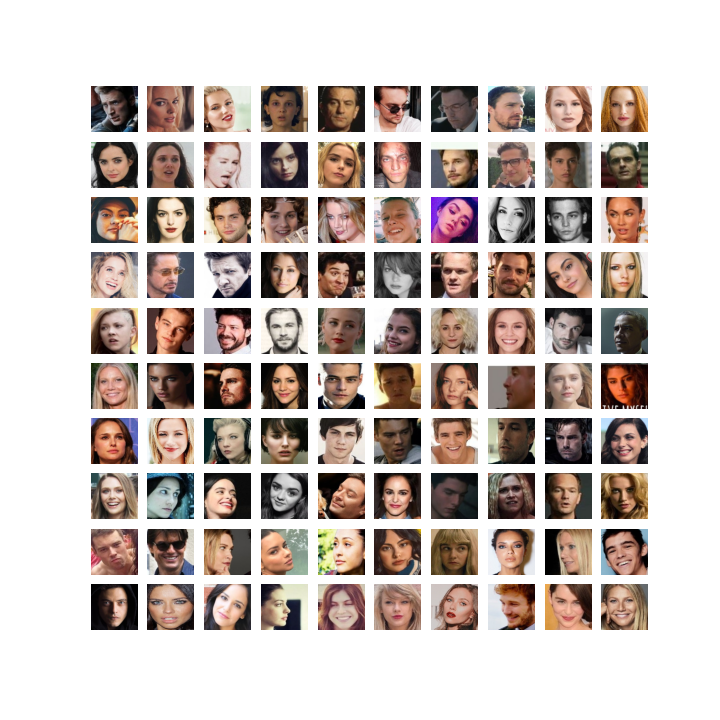

# Celebrity Face Recognition using Transfer Learning

## Description:
This project builds a Deep CNN using **Transfer Learning** method.
  - Dataset: [Kaggle Pinterest celebrity faces](https://www.kaggle.com/datasets/hereisburak/pins-face-recognition)
    - There are 17534 faces of 105 celebrities
  - Randomly create training test datasets
  - Model: `MobileNetV2` 155 layers
    - `MobileNetV2()` with `imagenet` weights -->  `Dropout layer` --> `Global Average Pooling2D layer` --> `softmax layer`
    - `Dropout layer` - is a regularization technique where randomly selected neurons are ignored (droped out) during training, which helps to prevent overfitting.
    - `Global Average Pooling2D layer` - takes a tensor of size (input width) x (input height) x (input channels) and computes the average value of all values across the entire (input width) x (input height) matrix for each of the (input channels)
    - `softmax layer` - is an activation function to categorize the results into the `105` classes
  - `myCallback()` to stop training when accuracy reaches `98%` (for future reference)
  - Validation Accuracy: `96.81%`

  

## Prerequisites:
Below libraries are needed to execute this Python code.
- Python 3.9
- Tensorflow 2.8.0
- Keras 2.7.0
- Numpy
- Matplotlib

## Pre-Trained Weights:
The pre-trained model weights for the classification of 105 celebrities have been uploaded as a .zip file which can be extracted to obtain the .h5 file. This file can be loaded with the Tensorflow in case without training the model again to obtain the new weights.
